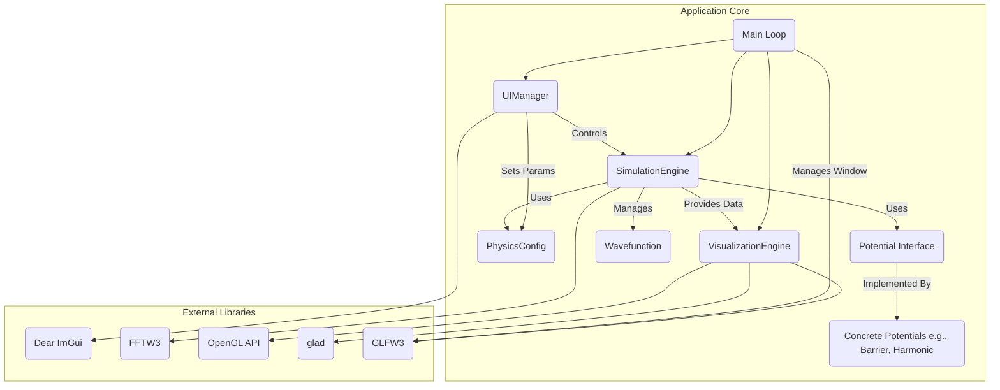

# Quantum Mechanics Simulation - Design Document

*   **Document Version:** 1.2
*   **Date:** 2024-05-17 (Updated)
*   **Author:** Eric Hammond, Gemini2.5, o4-mini
*   **Project Location Context:** Sherwood Park, Alberta, Canada

## Table of Contents
- [1. Introduction](#1-introduction)
- [2. Target Audience](#2-target-audience)
- [3. Core Requirements](#3-core-requirements)
  - [3.1 Functional Requirements](#31-functional-requirements)
  - [3.2 Non-Functional Requirements](#32-non-functional-requirements)
  - [3.3 Implementation Clarifications](#33-implementation-clarifications)
- [4. System Architecture](#4-system-architecture)
- [5. Detailed Design](#5-detailed-design)
- [6. Technology Stack](#6-technology-stack)
- [7. Visualization Subsystem Details](#7-visualization-subsystem-details)
- [8. Physics Implementation Details](#8-physics-implementation-details)
- [9. User Interface Details](#9-user-interface-details)
- [10. Build & Deployment](#10-build--deployment)
- [11. Testing Strategy](#11-testing-strategy)
- [12. Future Considerations](#12-future-considerations)
- [13. Glossary](#13-glossary)

## 1. Introduction

*   **1.1. Purpose:** This document provides the detailed design specification for implementing a high-performance, visually interactive 2D quantum mechanics simulation application. It defines the requirements, architecture, core components, algorithms, technology stack, and validation criteria.
*   **1.2. Scope (Phase 1):**
    *   Implementation of a numerical solver for the 2D Time-Dependent Schrödinger Equation (TDSE) for a single, non-relativistic particle.
    *   Utilization of the Split-Step Fourier Method (SSFM) for time evolution.
    *   Support for user-configurable initial wavefunctions (specifically Gaussian wavepackets).
    *   Support for user-configurable, time-independent 2D potentials (e.g., free space, square barrier/well, harmonic oscillator).
    *   Real-time visualization of the wavefunction's probability density ($|\Psi|^2$) using OpenGL.
    *   A basic Graphical User Interface (GUI) for simulation control and parameter adjustment.
    *   Optimization for performance on modern multi-core CPUs using C++ and OpenMP.
*   **1.3. Goals:**
    *   **Performance:** Achieve interactive frame rates (> 30 FPS) for the visualization on typical grid sizes (e.g., 512x512) on target hardware (e.g., a mid-range multi-core desktop CPU from the last ~5 years like Intel Core i5/i7 or AMD Ryzen 5/7).
    *   **Accuracy:** Ensure numerical stability and verifiable physics behavior (e.g., probability conservation, correct free particle propagation, basic tunneling/reflection).
    *   **Usability:** Provide a simple interface for users to set up, run, and observe simulations.
    *   **Modularity & Extensibility:** Design components with clear interfaces to facilitate future enhancements (e.g., 3D, new potentials, GPU acceleration).
*   **1.4. Non-Goals (Phase 1):**
    *   3D simulation.
    *   Relativistic effects (Dirac/Klein-Gordon equations).
    *   Multi-particle simulations or interactions.
    *   Time-dependent potentials (unless trivial to add alongside SSFM).
    *   Advanced boundary conditions (e.g., Perfectly Matched Layers - PML). Assume periodic boundaries inherent to FFT or simple zero-value boundaries far from the region of interest.
    *   Saving/loading simulation states.
    *   GPU acceleration (CUDA/OpenCL/SYCL) - deferred to a potential future phase.
    *   Web deployment or complex installation procedures.

## 2. Target Audience

This document is intended for experienced C++ developers who are expected to be familiar with:

*   Modern C++ (C++17 or later).
*   Numerical methods and simulation concepts.
*   Parallel programming, specifically OpenMP.
*   Basic principles of graphics programming (OpenGL concepts are beneficial).
*   Build systems like CMake.

## 3. Core Requirements

*   **3.1. Functional Requirements:**
    *   **FR1:** The system shall numerically solve the 2D TDSE: 
    $$ 
    i\hbar \frac{\partial \Psi}{\partial t} = \left[ -\frac{\hbar^2}{2m}\left(\frac{\partial^2}{\partial x^2} + \frac{\partial^2}{\partial y^2}\right) + V(x,y) \right] \Psi 
    $$
    *   **FR2:** The system shall implement the second-order Symmetric Split-Step Fourier Method for time evolution.
    *   **FR3:** The system shall allow initialization of the wavefunction $\Psi(x,y,t=0)$ as a 2D Gaussian wavepacket with user-defined parameters (center position $(x_0, y_0)$, standard deviations $(\sigma_x, \sigma_y)$, initial momentum $(k_x, k_y)$). See Section 8 for the precise formula and normalization.
    *   **FR4:** The system shall provide implementations for at least the following static potentials $V(x,y)$: Free Space ($V=0$), Square Barrier/Well (user-defined position, size, height/depth), 2D Harmonic Oscillator ($V=\frac{1}{2}m\omega^2(x^2+y^2)$ with user-defined $\omega$). The potential selection and its parameters shall be configurable via the GUI.
    *   **FR5:** The system shall calculate the probability density $P(x,y,t)=|\Psi(x,y,t)|^2$ at each visualization step.
    *   **FR6:** The system shall display the probability density $P(x,y,t)$ as a 2D color map in real-time using OpenGL.
    *   **FR7:** The system shall provide a GUI (using Dear ImGui) with controls for:
        *   Starting, stopping, and resetting the simulation.
        *   Selecting the potential type.
        *   Adjusting parameters for the selected potential (with reasonable ranges/validation).
        *   Adjusting parameters for the initial wavepacket (with reasonable ranges/validation).
        *   Adjusting the simulation time step $\Delta t$ (with reasonable range/validation).
        *   Displaying the current simulation time and visualization frame rate (FPS).
    *   **FR8:** The system shall allow configuration of core physics parameters ($m, \hbar$) and grid parameters (dimensions $(N_x, N_y)$, spatial step $(\Delta x, \Delta y)$). **For Phase 1, use scaled units $\hbar=1, m=1$ internally to simplify equations.** Conversion to/from physical units, if needed, should happen outside the core simulation logic.

### 3.1.1 Algorithm Comparison

| Scheme                 | Order | Stability       | Complexity      |
|------------------------|-------|-----------------|-----------------|
| Split-Step Fourier     | 2nd   | Unconditional   | O(N log N)      |
| Crank–Nicolson FDTD    | 2nd   | Unconditional   | O(N^2) per step |
| Runge–Kutta 4          | 4th   | Conditional     | O(N) per step   |

```yaml
simulation:
  grid_size: [512, 512]
  delta_time: 1e-3
  potential:
    type: harmonic
    omega: 1.0
```

*   **3.2. Non-Functional Requirements:**
    *   **NFR1 (Performance):** Simulation and rendering loop shall maintain > 30 FPS on a target machine (specified in 1.3) for a grid size of 512x512. CPU-intensive loops (potential application, probability calculation, FFT steps) must be parallelized using OpenMP.
    *   **NFR2 (Accuracy):** The total integrated probability $\iint |\Psi|^2 dx dy$ shall remain constant (within a small numerical tolerance, e.g., < $10^{-6}$ deviation) throughout the simulation for numerically stable parameters. The SSFM implementation shall be second-order accurate in time.
    *   **NFR3 (Memory):** Memory usage shall be reasonable for the grid size (e.g., a 1024x1024 grid using `complex<double>` should use roughly $1024 \times 1024 \times 16$ bytes = 16 MiB plus overhead for FFT buffers, etc.). Use contiguous memory allocation (e.g., `std::vector`) for the wavefunction grid, assuming row-major order consistent with C/FFTW.
    *   **NFR4 (Maintainability):** Code shall adhere to modern C++ best practices (RAII, smart pointers, const correctness). Components shall have clear responsibilities and interfaces. Code shall be well-commented, especially complex algorithms or physics implementations.
    *   **NFR5 (Extensibility):** The design shall allow for straightforward addition of new `Potential` implementations. The separation between the simulation engine and visualization should allow for future changes (e.g., different visualization techniques or migration to 3D).
    *   **NFR6 (Platform):** The primary development and build target is Linux (e.g., Ubuntu 20.04+). Use CMake for building. Ensure compatibility with GCC 9+ or Clang 10+. Cross-platform compatibility (Windows, macOS) is desirable but secondary for Phase 1.
    *   **NFR7 (Error Handling):** Basic error handling should be implemented. Invalid user inputs in the GUI should be prevented or handled gracefully (e.g., clamping values, displaying messages). Critical errors (e.g., FFTW initialization failure) should be logged and reported appropriately.

## 3.3 Implementation Clarifications

### 3.3.1 Folder Structure
Define a clear module structure:
```
src/
  core/          # Physics engine, wavefunction, potential interfaces
  solver/        # SSFM implementation and FFTW integration
  visualization/ # OpenGL rendering, shaders, colormaps
  ui/            # ImGui interface and input handling
  config/        # Configuration loaders and serializers
tests/           # Unit and integration tests
```

### 3.3.2 Data Formats & Serialization
- Use JSON or HDF5 for checkpointing simulation state.
- Export time-series observables (e.g., total probability) as CSV or JSON.

### 3.3.3 API Signatures
- createHamiltonian(grid: Grid, params: HamiltonianParams): Hamiltonian
- propagate(psi0: Wavefunction, H: Hamiltonian, dt: number, steps: number): Wavefunction[]
- computeExpectation(psi: Wavefunction, operator: Operator): number

### 3.3.4 Testing Strategy
- Unit tests for analytic cases (free packet, harmonic ground state).
- Regression tests with known eigenstates (infinite well, oscillator).
- Performance benchmarks on large grids.

### 3.3.5 Dependency Matrix
- Linear algebra: FFTW3 (parallel), Eigen or NumericalRecipes.
- Visualization: OpenGL3.3+, GLFW3, GLAD, Dear ImGui.
- Build & CI: CMake, GitHub Actions or GitLab CI.

### 3.3.6 Continuous Integration
- Enforce coding standards (clang-format, clang-tidy).
- Automated test runs with coverage reports.
- Build matrix: Linux (GCC/Clang), Windows (MSVC), macOS

## 4. System Architecture

The application will be composed of the following major components:



*   **Main Loop:** Orchestrates the application, handles window events (via GLFW), manages timing, calls update/render methods of other components. **Note:** For Phase 1, assume a single-threaded loop where simulation steps block rendering. If UI responsiveness becomes an issue, consider moving `SimulationEngine::step` to a separate thread, requiring synchronization for accessing shared data like `PhysicsConfig` or `Wavefunction` data for visualization.
*   **SimulationEngine:** Encapsulates the core physics simulation logic (TDSE solver via SSFM).
*   **Wavefunction:** Data structure holding the complex grid data $\Psi(x,y)$.
*   **Potential Interface:** Abstract interface defining how potentials $V(x,y)$ are evaluated.
*   **Concrete Potentials:** Specific implementations of the potential interface.
*   **PhysicsConfig:** Stores simulation parameters ($\hbar, m$, grid details, $\Delta t$). Consider loading initial defaults from a simple config file (e.g., JSON) or hardcoding them.
*   **VisualizationEngine:** Handles all OpenGL rendering, shader management, texture updates for displaying $|\Psi|^2$.
*   **UIManager:** Manages the ImGui interface, handles user input, and communicates changes to other components.

## 5. Detailed Design

*   **5.1. `Wavefunction` Class:**
    *   `Responsibilities`: Manage contiguous memory (row-major) for the $N_x \times N_y$ complex grid; provide safe accessors; compute probability density; define coordinate mapping.
    *   `Data Members`:
        *   `std::vector<std::complex<double>> gridData;` (Primary storage)
        *   `size_t width;` ($N_x$)
        *   `size_t height;` ($N_y$)
        *   `double dx;` ($\Delta x$)
        *   `double dy;` ($\Delta y$)
        *   `double x_min, y_min;` // Physical coordinates of grid point (0, 0)
    *   `Methods`:
        *   `Wavefunction(size_t nx, size_t ny, double deltaX, double deltaY);` // Constructor should also set x_min, y_min (e.g., x_min = -nx*deltaX/2.0)
        *   `void initializeGaussian(double x0, double y0, double sigmaX, double sigmaY, double kx, double ky);` // See Sec 8 for formula. Normalize internally.
        *   `std::complex<double>& operator()(size_t ix, size_t iy);` // Access via grid index (row-major: index = iy * width + ix). Add bounds checking (assert or exception).
        *   `const std::complex<double>& operator()(size_t ix, size_t iy) const;`
        *   `std::complex<double>* getDataPtr();`
        *   `void calculateProbabilityDensity(std::vector<float>& outDensity) const;` // Parallelize with OpenMP. outDensity size = width * height.
        *   `size_t getWidth() const; size_t getHeight() const;`
        *   `double getX(size_t ix) const;` // Returns physical x for grid index ix (x = x_min + ix * dx)
        *   `double getY(size_t iy) const;` // Returns physical y for grid index iy (y = y_min + iy * dy)
        *   `double getTotalProbability() const;` // For validation (numerical integration: sum(|Psi|^2 * dx * dy)). Parallelize.
*   **5.2. `Potential` Interface (Abstract Base Class):**
    *   `Responsibilities`: Define the interface for potential energy functions $V(x,y)$. Takes physical coordinates as input.
    *   `Methods`:
        *   `virtual double getValue(double x, double y) const = 0;`
        *   `virtual ~Potential() = default;`
        *   `virtual void updateParameters(/*... relevant params ...*/);` // Optional: Method to update potential parameters from GUI without recreating the object.
    *   `Concrete Implementations`:
        *   `FreeSpacePotential`: Returns 0.
        *   `SquareBarrierPotential`: Takes parameters (center $(x_c, y_c)$, width $w$, height $h$, barrier value $V_0$). Returns $V_0$ inside the rectangle defined by center, width, height, and 0 outside. Add parameter validation (w>0, h>0).
        *   `HarmonicOscillatorPotential`: Takes parameter ($\omega$). Requires mass $m$ (passed via constructor or reference from `PhysicsConfig`). Returns $\frac{1}{2}m\omega^2(x^2+y^2)$. Add parameter validation ($\omega > 0$).
*   **5.3. `PhysicsConfig` Struct:**
    *   `Data Members`: `double hbar = 1.0;`, `double mass = 1.0;`, `double deltaTime;`, `size_t gridWidth;` ($N_x$), `size_t gridHeight;` ($N_y$), `double deltaX;` ($\Delta x$), `double deltaY;` ($\Delta y$)
    *   **Note:** Consider adding default values for $\Delta t, N_x, N_y, \Delta x, \Delta y$ or loading them from a config source.
*   **5.4. `SimulationEngine` Class:**
    *   `Responsibilities`: Execute the SSFM algorithm; manage time stepping; interact with `Wavefunction` and `Potential`. Handle FFTW setup and execution.
    *   `Data Members`:
        *   `PhysicsConfig config;`
        *   `Wavefunction wavefunction;`
        *   `std::unique_ptr<Potential> potential;`
        *   `fftw_plan fftPlanForward = nullptr;`
        *   `fftw_plan fftPlanBackward = nullptr;`
        *   `std::complex<double>* fftwBufferIn = nullptr;` // FFTW input buffer (can alias wavefunction.gridData if suitable)
        *   `std::complex<double>* fftwBufferOut = nullptr;` // FFTW output buffer (k-space)
        *   `std::vector<double> kSqValues;` // Precomputed $k_x^2 + k_y^2$ values for each k-space grid point.
        *   `double currentTime = 0.0;`
        *   `bool isRunning = false;`
    *   `Methods`:
        *   `SimulationEngine(PhysicsConfig cfg);`
        *   `~SimulationEngine();` // Cleanup FFTW plans and buffers (`fftw_destroy_plan`, `fftw_free`). Call `fftw_cleanup_threads()` if threads were initialized.
        *   `void initialize();` // Setup FFTW (call `fftw_init_threads()`, `fftw_plan_with_nthreads()`), allocate buffers (`fftw_malloc`), create plans (`fftw_plan_dft_2d` using `FFTW_ESTIMATE` initially, maybe `FFTW_MEASURE` option), precompute `kSqValues` (see below), initialize wavefunction.
        *   `void setPotential(std::unique_ptr<Potential> pot);`
        *   `void step();` // Execute one SSFM step - detailed below.
        *   `void run(); void stop(); void reset();` // Control simulation state. Reset should re-initialize wavefunction and currentTime.
        *   `const Wavefunction& getWavefunction() const;`
        *   `double getCurrentTime() const;`
        *   `void updateConfig(const PhysicsConfig& newConfig);` // If grid size (Nx, Ny) changes: destroy old plans/buffers, update config, call `initialize()` again. If only Δt, m, hbar change: update config, recompute kSq factor if needed. Potential parameters updated via `UIManager` calling `potential->updateParameters()`.
    *   **FFTW k-space Details:**
        *   Use `fftw_plan_dft_2d` for complex-to-complex transforms.
        *   Input/Output buffers (`fftwBufferIn`, `fftwBufferOut`) should be allocated using `fftw_malloc` for potential alignment benefits. `fftwBufferIn` can potentially alias `wavefunction.gridData.data()` if memory layout is compatible and no in-place transform is used, but using separate buffers is safer.
        *   `kSqValues` Calculation: Precompute $k_x^2 + k_y^2$ for each grid point $(k_{ix}, k_{iy})$ in k-space. The k-vectors corresponding to grid indices $(ix, iy)$ are given by FFT conventions:
            *   $ k_x = 2\pi \times (ix / (N_x \Delta x)) $ for $ ix = 0, ..., N_x/2 $
            *   $ k_x = 2\pi \times ((ix - N_x) / (N_x \Delta x)) $ for $ ix = N_x/2 + 1, ..., N_x - 1 $
            *   (Similar for $k_y$ with $N_y, \Delta y, iy$).
            *   Store $k_x^2 + k_y^2$ in a `std::vector<double>` matching the layout of `fftwBufferOut`. Parallelize this precomputation.
    *   **SSFM Step Implementation (`step()` method):**
        *   **Potential Half Step (Real Space):** Apply $ \exp(-i V(x, y) \Delta t / (2\hbar)) $ to `wavefunction.gridData`. Iterate through `ix, iy`, get physical coords `x = wavefunction.getX(ix)`, `y = wavefunction.getY(iy)`, get `V(x,y)` from `potential->getValue(x, y)`, apply factor. Parallelize this loop using OpenMP (`#pragma omp parallel for`).
        *   **Kinetic Full Step (k-Space):**
            *   Perform forward FFT: `fftw_execute_dft(fftPlanForward, fftwBufferIn, fftwBufferOut)`. Ensure `fftwBufferIn` contains current wavefunction data.
            *   Apply kinetic operator: Multiply `fftwBufferOut[idx]` by $ \exp(-i \hbar kSqValues[idx] \Delta t / (2m)) $. Parallelize this loop using OpenMP (`#pragma omp parallel for`).
            *   Perform backward FFT: `fftw_execute_dft(fftPlanBackward, fftwBufferOut, fftwBufferIn)`. Output is now in `fftwBufferIn`.
        *   **Normalization (FFTW):** After the backward FFT, divide every element in `fftwBufferIn` by $N_x \times N_y$ to correct for FFTW's unnormalized transform. Parallelize using OpenMP.
        *   **Update Wavefunction:** Copy result from `fftwBufferIn` back to `wavefunction.gridData` if separate buffers were used.
        *   **Potential Second Half Step (Real Space):** Apply $ \exp(-i V(x, y) \Delta t / (2\hbar)) $ to `wavefunction.gridData` (or `fftwBufferIn` before copy-back). Parallelize using OpenMP.
        *   Increment `currentTime += config.deltaTime`.
*   **5.5. `VisualizationEngine` Class:**
    *   `Responsibilities`: Manage OpenGL state, shaders, textures for display.
    *   `Data Members`: GLFW window pointer, Shader Program ID, Texture ID, VAO/VBO for a screen-aligned quad, screen dimensions, Colormap Texture ID (optional).
    *   `Methods`:
        *   `bool initialize(GLFWwindow* window);` // Compile shaders, create texture (`GL_R32F`), setup quad VBO/VAO, potentially load colormap texture.
        *   `void render(const std::vector<float>& probabilityDensity, int width, int height);` // Update texture with density data (`glTexSubImage2D`), bind colormap texture (if used), draw quad.
        *   `void cleanup();` // Delete OpenGL objects (shaders, textures, buffers, VAO).
    *   **Shaders (GLSL):**
        ```glsl
        // Vertex Shader (simple_texture.vert)
        #version 330 core
        layout (location = 0) in vec3 aPos;
        layout (location = 1) in vec2 aTexCoord;
        out vec2 TexCoord;
        void main() {
            gl_Position = vec4(aPos, 1.0);
            TexCoord = aTexCoord;
        }
        ```
        ```glsl
        // Fragment Shader (density_colormap.frag)
        #version 330 core
        out vec4 FragColor;
        in vec2 TexCoord;
        uniform sampler2D densityTexture;
        // uniform sampler1D colormapTexture; // Option 1: Colormap lookup texture

        // Option 2: Hardcoded colormap function (e.g., simple grayscale or basic jet)
        vec3 applyColormap(float value) {
            // Example: Grayscale
            // return vec3(value);

            // Example: Simple blue-red (clamp value to [0,1] first)
             value = clamp(value, 0.0, 1.0);
             return vec3(value, 0.0, 1.0 - value);

            // TODO: Implement a better map like Viridis or use a lookup texture
        }

        void main() {
            float density = texture(densityTexture, TexCoord).r;
            // Option 1: Use 1D lookup texture
            // vec3 color = texture(colormapTexture, density).rgb;

            // Option 2: Use hardcoded function
            vec3 color = applyColormap(density);

            FragColor = vec4(color, 1.0);
        }
        ```
*   **5.6. `UIManager` Class:**
    *   `Responsibilities`: Setup and render ImGui widgets; handle user input; modify `PhysicsConfig` and control `SimulationEngine`.
    *   `Data Members`: Pointers/references to `SimulationEngine`, `PhysicsConfig`. Internal state for widget values (e.g., temporary storage for potential parameters before applying).
    *   `Methods`:
        *   `bool initialize(GLFWwindow* window, const char* glsl_version);` // Setup ImGui context and GLFW/OpenGL3 backends.
        *   `void processInput();` // Called once per frame before defining UI. Handles ImGui input state.
        *   `void createFrame();` // Define ImGui window layout and widgets (buttons, sliders, input fields, combo boxes). Connect widget actions to `SimulationEngine` methods (start/stop/reset, setPotential) or update `PhysicsConfig` (requires calling `SimulationEngine::updateConfig` if relevant parameters change). Use input validation/clamping for numerical fields.
        *   `void render();` // Call ImGui rendering functions (`ImGui::Render()`, `ImGui_ImplOpenGL3_RenderDrawData()`).
        *   `void cleanup();` // Shutdown ImGui backends and context.

## 6. Technology Stack

*   **Language:** C++17
*   **Compiler:** GCC 9+ or Clang 10+
*   **Build System:** CMake 3.15+
*   **Core Libraries:**
    *   **FFT:** FFTW3 (v3.3.8+ recommended). Requires linking `libfftw3` and `libfftw3_omp`. Ensure thread-safe version is initialized (`fftw_init_threads`, `fftw_plan_with_nthreads`).
    *   **Windowing & Input:** GLFW3 (v3.3+ recommended)
    *   **OpenGL Loading:** glad (generate code for OpenGL 3.3+ Core profile)
    *   **GUI:** Dear ImGui (v1.88+ recommended) - integrated directly or as submodule. Use GLFW/OpenGL3 backend.
    *   **Parallelization:** OpenMP (require compiler flag, e.g., `-fopenmp`)
*   **Standard Library:** `<vector>`, `<complex>`, `<cmath>`, `<memory>`, `<chrono>`, `<numeric>` (for `std::accumulate` in validation), etc.

## 7. Visualization Subsystem Details

*   **Target:** OpenGL 3.3 Core Profile.
*   **Rendering:** Render probability density $P(x,y)$ onto a screen-aligned quad covering the viewport.
*   **Texture:** Use a 2D texture (`GL_TEXTURE_2D`) with internal format `GL_R32F` to store the floating-point probability density. Update using `glTexSubImage2D` per frame (or less frequently if needed for performance). Use `GL_NEAREST` filtering for exact grid representation or `GL_LINEAR` for smoother appearance.
*   **Colormap:** Implement a colormap function within the fragment shader (see 5.5) or, preferably, use a precomputed 1D texture (`GL_TEXTURE_1D`) as a lookup table (LUT). The LUT approach is more flexible for trying different colormaps (Viridis, Plasma, Jet, etc.). The 1D texture would map normalized density [0, 1] to RGB colors.

## 8. Physics Implementation Details

*   **Equation:** 2D TDSE as specified (FR1), using $\hbar=1, m=1$.
*   **Solver:** Second-order Symmetric SSFM (FR2).
*   **Initial State:** 2D Gaussian wavepacket:
    $$ \Psi(x,y,0) = A \exp\left(-\frac{(x-x_0)^2}{4\sigma_x^2} - \frac{(y-y_0)^2}{4\sigma_y^2} + i(k_x x + k_y y)\right) $$
    The normalization constant $A$ required for $\iint |\Psi|^2 dx dy = 1$ is:
    $$ A = \frac{1}{\sqrt{2\pi \sigma_x \sigma_y}} $$
    (Note: The factor of 4 in the exponent denominator corresponds to $\sigma$ being the standard deviation of $|\Psi|$, not $|\Psi|^2$. The normalization constant $A$ ensures the integral of $|\Psi|^2$ is 1).
    Configurable parameters: $x_0, y_0, \sigma_x, \sigma_y, $k_x, k_y$. Ensure $\sigma_x > 0, \sigma_y > 0$.
*   **Potentials:** Implement classes derived from `Potential` interface for Free Space, Square Barrier/Well, 2D Harmonic Oscillator (FR4). Parameter validation (e.g., non-zero $\omega$, non-negative width/height) should be included in setters or update methods.
*   **Units:** Use scaled units $\hbar=1, m=1$ throughout the simulation core. GUI inputs/displays can be scaled if desired, but the internal calculations use these values.
*   **Grid Coordinates:** The grid indices $(ix, iy)$ map to physical coordinates $(x, y)$ typically centered around (0,0). Define $L_x = N_x \Delta x$, $L_y = N_y \Delta y$. Physical coordinates range:
    *   $ x \in [-L_x/2, L_x/2 - \Delta x] $ (assuming `x = (ix - Nx/2) * dx`)
    *   $ y \in [-L_y/2, L_y/2 - \Delta y] $ (assuming `y = (iy - Ny/2) * dy`)
    The `Wavefunction` class should store the origin offset (`x_min`, `y_min`) and provide helper functions `getX(ix)`, `getY(iy)`.
*   **Boundaries:** The use of FFT implies periodic boundary conditions. Ensure the simulation domain $(L_x, L_y)$ is large enough and/or simulation time is short enough that the wavefunction does not significantly interact with the boundaries (i.e., wrap around) unless periodic behavior is intended.

## 9. User Interface Details

Implement an ImGui window containing sections for:

*   **Controls:** "Start", "Stop", "Reset" buttons.
*   **Simulation Parameters:** Read-only display of grid size ($N_x \times N_y$). Input field/slider for $\Delta t$ (e.g., range [1e-5, 1e-2], default 1e-3).
*   **Potential Selection:** Dropdown/radio buttons for potential type ("Free Space", "Barrier/Well", "Harmonic"). Context-sensitive input fields for parameters of the selected potential (e.g., Barrier: $V_0$ [range -10..10], $x_c, y_c$ [range based on grid], $w, h$ [range > 0]; Harmonic: $\omega$ [range 0.1..10]). Add "Apply Changes" button for potential parameters.
*   **Initial Wavepacket:** Input fields/sliders for $x_0, y_0$ [range based on grid], $\sigma_x, \sigma_y$ [range > 0, e.g., 0.1..Lx/4], $k_x, k_y$ [range e.g., -10..10]. Changes here should likely trigger a simulation reset.
*   **Monitoring:** Display current simulation time `t`, visualization FPS, total probability (as a check, e.g., $ P_{tot} = \sum |\Psi_{ij}|^2 \Delta x \Delta y $)).

## 10. Build & Deployment

*   Use CMake (`CMakeLists.txt`) for configuration and building.
*   Use `find_package` for dependencies (FFTW3 REQUIRED COMPONENTS fftw3 fftw3_omp, OpenGL REQUIRED, OpenMP REQUIRED, glfw3 REQUIRED).
*   Provide standard build targets (e.g., `make`, `make install`).
*   Include instructions (e.g., in a README.md) for obtaining dependencies (package manager commands for Linux) and building the project.

## 11. Testing Strategy

*   **Unit Tests (e.g., Google Test):**
    *   Test `Wavefunction` accessors, index calculations, coordinate mapping (`getX`, `getY`), probability calculation, normalization (`initializeGaussian`), total probability calculation.
    *   Test `Potential` implementations for known coordinate values and parameter updates.
    *   Test basic FFTW integration (e.g., transform a known function like a Gaussian, inverse transform, check result accuracy and normalization).
*   **Integration Tests:**
    *   Verify `SimulationEngine::step` correctly applies potential values (check a few grid points).
    *   Verify `UIManager` updates `PhysicsConfig` and correctly controls `SimulationEngine` state (run/stop/reset) and potential parameters.
    *   Verify `VisualizationEngine` correctly receives data and renders (visual inspection, maybe check texture values).
*   **Physics Validation:**
    *   **Probability Conservation:** Monitor $ \sum |\Psi_{ij}|^2 \Delta x \Delta y $ over time; it must remain constant $1.0 \pm 10^{-6}$.
    *   **Free Particle:** Initialize Gaussian with $k_x > 0, k_y = 0$. Verify wavepacket center $\langle x \rangle (t) = \sum x |\Psi(x,y,t)|^2 \Delta x \Delta y$ moves according to $\langle x \rangle (t) = x_0 + (\hbar k_x / m) t$ (using $\hbar=1, m=1$). Qualitatively check spread $\Delta x$ increases.
    *   **Harmonic Oscillator:** Initialize in ground state (Gaussian with $\sigma_x = \sigma_y = \sqrt{\hbar / (m\omega)}$, $k_x=k_y=0$). Verify $|\Psi|^2$ remains static and $\langle E \rangle = \sum \Psi^* H \Psi \Delta x \Delta y$ remains constant and equals $0.5 \hbar \omega$ (using $\hbar=1, m=1$). Initialize as a displaced Gaussian (coherent state) and verify oscillation of $\langle x \rangle (t)$ at frequency $\omega$.
    *   **Square Barrier:** Initialize Gaussian moving towards a barrier ($E = \hbar^2 k^2 / (2m) < V_0$). Verify partial reflection and transmission (tunneling). Calculate transmission/reflection coefficients ($T = \int_{x>barrier} |\Psi|^2 dx dy$, $R = \int_{x<barrier} |\Psi|^2 dx dy$ after long time) and check $R+T \approx 1$. Compare qualitatively to expected exponential decay of T with barrier width/height.

## 12. Future Considerations (Post Phase 1)

*   Extend to 3D simulation.
*   Implement absorbing boundary conditions (e.g., complex absorbing potential or PMLs).
*   Add support for time-dependent potentials.
*   GPU acceleration using CUDA/OpenCL/SYCL.
*   Implement alternative solvers (e.g., Crank-Nicolson FDTD).
*   More sophisticated visualization (isosurfaces, phase plots, vector fields for probability current).
*   Saving/loading simulation state and parameters.
*   Support for different particle types or interactions (major scope increase).

## 13. Glossary

*   **TDSE:** Time-Dependent Schrödinger Equation
*   **SSFM:** Split-Step Fourier Method
*   **FFT:** Fast Fourier Transform
*   **FFTW:** Fastest Fourier Transform in the West (library)
*   **Wavefunction ($\Psi$):** Complex function describing the state of a quantum system.
*   **Probability Density ($|\Psi|^2$):** Likelihood of finding the particle per unit volume/area.
*   **Potential ($V(x,y)$):** Potential energy landscape experienced by the particle.
*   **Hamiltonian ($\hat{H}$):** Operator representing the total energy of the system.
*   **OpenGL:** Open Graphics Library (API for rendering 2D/3D graphics).
*   **GLSL:** OpenGL Shading Language.
*   **GLFW:** Library for creating windows, contexts, and handling input for OpenGL.
*   **glad:** OpenGL Loading Library.
*   **Dear ImGui:** Bloat-free immediate mode graphical user interface library.
*   **OpenMP:** API for shared-memory parallel programming.
*   **CMake:** Cross-platform build system generator.
*   **RAII:** Resource Acquisition Is Initialization (C++ idiom).
*   **LUT:** Look-Up Table.

